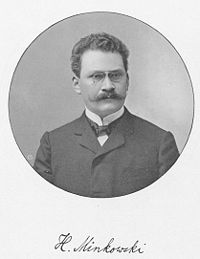

# Inclusión de imaxes

As imaxes a incluír pódense gardar nun subdirectorio do propio repositorio ou poden ser imaxes externas enlazadas no ficheiro.

## Creación dun subdirectorio

Propiamente non hai un comando específico para crear subdirectorios. O que se fai é crear un documento, por exemplo `imaxes/falso.md`. En `falso.md` poñer calquera cousa, porque se vai borrar e despois gardar. Deste xeito crea o subdirectorio `imaxes`.

## Poñer imaxes no subdirectorio

Entrar no subdirectorio e premer na tecla `Upload files`. Nesta situación podemos arrastrar imaxes que temos no ordenador ao rectángulo central e soltar co cal quedan pedentes de descargar. Tamén podemos pinchar no enlace `choose your files` que fai aparecer unha fiestra de navegación para ir ás imaxes que temos no ordenador e seleccionalas. A medida que engadimos imaxes quedan pendentes nun listado. Cando rematemos premer na tecla verde `Commit changes` e entón é cando se van descargar as imaxes.

## Eliminar ficheiros

Para eliminar un ficheiro hai que entrar no mesmo. Ao lado da icona de editar, aparece a icona da papeleira. Ao premer nela borra o ficheiro.

## Enlazar a unha imaxe no subdirectorio de imaxes

Para enlazar unha imaxe, hai que comezar cunha admiración pechada. A continuacin entre corchetes pónse un nome para imaxe que aparecerá cando ao sistema lle custa cargar a imaxe e tarda un pouco. Despois ponse entre parénteses o nome do subdirectorio, seguindo dunha barra / e o nome do ficheiro da imaxe. Se se quere poñer un título á imaxe para que apareza cando pasamos co rato por riba, antes de pechar o paréntese, deixar un espazo e poñer entre comiñas dobres o título.

``

 
## Enlazar a unha imaxe externa
 
A diferencia do apartado anterior, hai que poñer o enlace completo á imaxe.
 
``

